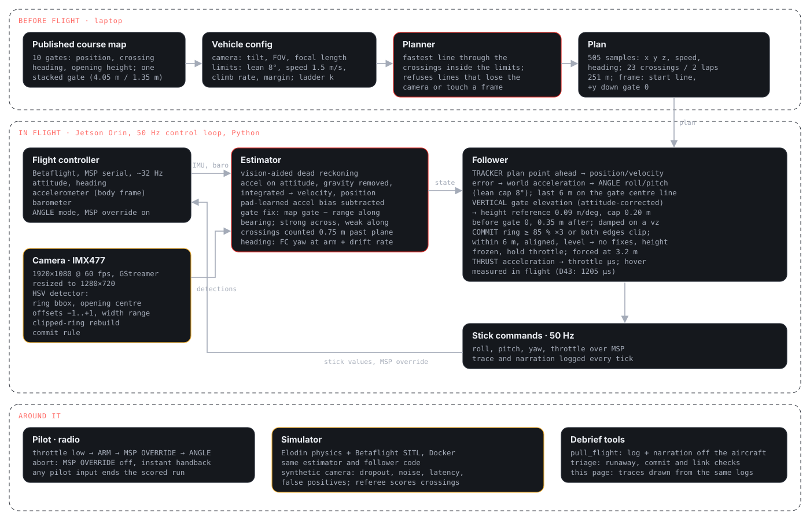

# AI-GrandPrix

An autonomy stack for the [Anduril AI Grand Prix](https://www.theaigrandprix.com), an autonomous drone racing
competition run by the Drone Champions League. Every team flies the same aircraft: a DCL racing quad with a
Betaflight flight controller, an NVIDIA Jetson Orin, and one forward camera. The aircraft has to fly the course
by itself; a pilot arms it and any stick input ends the run.

This repository is the full stack, built from scratch between June and September 2026: gate perception,
vision-aided state estimation, trajectory planning, the flight controller interface, the simulator integration,
and the field tooling that ran it on the competition aircraft in Costa Mesa.

**Team debrief and technical report:** https://bstandage.github.io/AI-GrandPrix/ (built from [`site/`](site/)).

| | |
|---|---|
| Virtual Qualifier 2 | top 15 of 3,300+ teams worldwide |
| Physical Qualifier, Costa Mesa, 15–22 Sep 2026 | 14 autonomous course flights, 0 gates scored, did not advance |
| Team | [Brian Standage](https://www.linkedin.com/in/brian-standage-22835912a/) (lead, software), [Cristhian Prado](https://www.linkedin.com/in/pradocristhian/), [Reese Haven](https://www.linkedin.com/in/reese-haven-6a57a1224/) |

## Architecture



Before flight, the published course map and a vehicle config go into a planner that writes a time-parameterised
plan (23 crossings over two laps). In flight, on the Jetson at 50 Hz: the flight controller's attitude,
accelerometer and barometer arrive over MSP; the camera's gate detections correct a dead-reckoned position against
the map; the follower tracks the plan, steers height on the gate's elevation angle, and sends roll, pitch, yaw and
throttle stick values back to the flight controller in ANGLE mode with MSP override. The same estimator and
follower code runs in the simulator against a synthetic camera.

There is no position sensor on the aircraft (no GPS, rangefinder or optical flow), and the only link to the flight
controller is a 32 Hz serial channel. Both constraints shaped the design, and the second is what beat it: see the
report's [state estimation](https://bstandage.github.io/AI-GrandPrix/#estimation) section and
[`docs/DEBRIEF_2026-09-22.md`](docs/DEBRIEF_2026-09-22.md).

## Layout

```
src/
  perception/      HSV gate detector: ring, opening, image offsets, width-based range, commit rule
  seeker/          vision-aided dead reckoning (dr_estimator.py), synthetic camera for the sim
  raceline/        course map, planner, ladder, batch_fly (sim runs), replay, triage, debrief
  solvers/         follower.py: the tracker, the vertical channel, the commit hold, ANGLE sticks
  hardware/        runtime.py (the flight program), msp.py, camera calibration, hover/bench/tilt tools
  common/          camera model and course-map loaders shared by sim and aircraft
config/            vehicle configs (camera model + flight limits); config/ladder/ holds the flown rungs
data/              course_map.json, the organizers' published course
docs/              procedures, flight cards, debriefs, handoffs, calibration, sim setup
flightlogs/        every hardware flight: CSV trace + narration log, by day
scripts/           sync_drone.sh, pull_flight.sh, sim_sweep.sh, drone ASCII art
site/              the team debrief as a Vite + React site, built from these logs
```

The simulator lives in a sibling checkout, [`elodin-sim-aigp`](https://github.com/BStandage/elodin-sim-aigp):
a fork of an open-source Elodin drone simulator with the Betaflight SITL firmware in the loop and the published
course built in. Setup: [`docs/ELODIN_SIM_SETUP.md`](docs/ELODIN_SIM_SETUP.md).

## Running it

**Plan.** From `src`, with a vehicle config:

```
python -m raceline.planner --config ../config/ladder/vehicle_s15_cam20_75.toml
```

writes `out/plans/plan_*.json`: the line, the speed at every point, the crossings in order.

**Fly the plan in the simulator** (Docker running, sim repo next door):

```
AIGP_LAPS=2 AIGP_VERT=vision AIGP_STATE_SOURCE=deadreckon AIGP_CAM_TILT_DEG=10 AIGP_CAM_HFOV_DEG=75 \
python -m raceline.batch_fly --angle ../out/plans/plan_STACK_s15_cam20_75.json \
    --config ../config/ladder/vehicle_s15_cam20_75.toml --timeout 430
```

`scripts/sim_sweep.sh N` flies N seeds and tabulates gates, strikes and commit ranges.

**Fly it on the aircraft.** Bring-up is [`docs/NEW_DRONE_SETUP.md`](docs/NEW_DRONE_SETUP.md), calibration is
[`docs/CAMERA_CALIBRATION.md`](docs/CAMERA_CALIBRATION.md), the race-day procedure with the exact commands is
[`docs/RACE.md`](docs/RACE.md). In short: `scripts/sync_drone.sh d43` ships the working tree to the Jetson, and on
the aircraft

```
python3 -m hardware.runtime --port /dev/ttyTHS1 --pilot follower \
    --traj ../out/plans/plan_STACK_s15_cam20_75.json \
    --config ../config/ladder/vehicle_s15_cam20_75.toml \
    --fy 835.5 --cam-tilt 10 --map-north here --vert vision --arm
```

waits for the pilot to arm and switch MSP override on, then flies. `scripts/pull_flight.sh d43` pulls the last
flight's trace and narration back and runs the triage checks.

**Rebuild the site's data** from the logs: `python site/scripts/extract.py`; the detection video over the
organizers' FPV lap: `python site/scripts/render_detections.py`.

## What happened

Fourteen autonomous course flights over 3.5 days on site. Takeoff, release, the approach height on the gate's
elevation, the lateral onto the gate's line and the size-based commit each worked on at least one flight. No flight
made it through the three-second blind segment after commit, because the aircraft has no vertical-speed source
that holds for three seconds: the barometer carries ±0.4 m/s of noise, the accelerometer over the serial link
reads about 0.35 m/s² low under the propellers, and the camera's elevation is lost once the ring clips the frame.
A hover throttle carried over from a sibling aircraft (1228 µs versus the real 1205 µs) turned every hold into a
climb for four of the seven race-day attempts.

Every flight is in [`flightlogs/`](flightlogs/) with its cause in
[`docs/HANDOFF_2026-09-22.md`](docs/HANDOFF_2026-09-22.md); the root-cause analysis is
[`docs/DEBRIEF_2026-09-22.md`](docs/DEBRIEF_2026-09-22.md). The next build starts with corner detection of the
gate opening, a calibrated camera and PnP for a metric pose, and an EKF over the IMU that carries the aircraft
through the crossing.

## Documents worth reading first

| document | what it is |
|---|---|
| [`docs/DEBRIEF_2026-09-22.md`](docs/DEBRIEF_2026-09-22.md) | why we did not pass a gate, ranked by cost |
| [`docs/HANDOFF_2026-09-22.md`](docs/HANDOFF_2026-09-22.md) | the race build, what is on each aircraft, every flight and its cause |
| [`docs/HOW_IT_FLIES.md`](docs/HOW_IT_FLIES.md) | the stack explained for a new team member; [`HOW_IT_FLIES_DETAILED.md`](docs/HOW_IT_FLIES_DETAILED.md) links into the code |
| [`docs/TRACK_2_DEBRIEF.md`](docs/TRACK_2_DEBRIEF.md) | the first autonomous gate approaches, four flights, four causes |
| [`docs/CAMERA_CALIBRATION.md`](docs/CAMERA_CALIBRATION.md) | the five numbers every camera fix depends on, and how to measure them |
| [`docs/RACE.md`](docs/RACE.md) | the race-day procedure, exact commands, abort rules |
