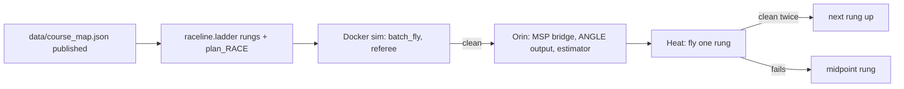

# PQ procedure: map -> solve -> race

Spec: `docs/specs/20260818_PQ_Technical_Spec_0001.pdf` (VADR-TS-004 / 00.01); published course and Orin quickstart PDFs alongside it.

- **15 min/day** on the real track.
- **2 laps** = complete run. Incomplete ranked by gates passed.
- Track **85 x 165 ft (25.9 x 50.3 m)**, 10 gates, 1.5 m inner opening,
  gate 9 is the **double gate**. Published coordinates 2026-09-15 are
  `data/course_map.json` (labels gK = organizer gate K+1).
- Start = the dashed orange line ~7.3 m behind gate 1 (`meta.start`); the
  solid bar just past gate 1 is probably the timing line.
- PQ course != VQ2. VQ2 tapes are archive only.

The map is PUBLISHED (2026-09-15) - there is no survey step. Race =
published map + planner + the ladder rung the day allows. The old
survey -> make_map -> solve pipeline (steady/giga/ace) was removed from
the tree on 2026-09-15 (git history) and is not part of PQ.

## Day 0 - board bring-up (Orin quickstart, 2026-09-15)

Before the cage, with the drone on the bench and props OFF:

1. USB-C to the micro-USB port, `ssh dcl@192.168.55.1` (pw `dcl`). If it
   hangs, give the laptop's RNDIS interface 192.168.55.100/24; fallback is
   the serial console on /dev/ttyACM0 at 115200.
2. `sudo ~/target/bringup-check.sh` - stops at the first broken layer.
   Then `uname -a` (5.15.148-tegra), `nvpmodel -q` (25W), `ls /dev/video0`.
3. `sudo ~/target/msp/setup_jetson_uart.sh --apply` once per board, then
   `python3 ~/target/msp/msp_bench.py --port /dev/ttyTHS1 info` - firmware
   identity, sensors, battery, arming blockers. `telemetry --hz 20` for a
   live attitude stream; `imu_check.py` for the IMU acceptance test.
4. `~/target/live-view-imu.py --msp /dev/ttyTHS1` - camera + attitude on
   one browser page at http://192.168.55.1:8080/ : both halves alive.
   Grey/flat colour over SSH is expected (no Argus without a display).
5. Save the Betaflight `diff all` to TWO places (see Day 1 item 3) and
   copy `~/target/msp/msp.py` + `msp_rc.py` into our tree - they are the
   RC-down / IMU-back library our runtime imports.
6. `frame-timestamps.py` -> CSV: frame period and jitter at 1920x1080@60,
   and the camera-vs-IMU clock offset (no shared clock, no trigger).
7. Decide the capture path (Argus needs an EGL context: headless X
   session at boot, or raw V4L2 + own debayer/AE) and prove it survives a
   reboot without a monitor.
8. `sudo shutdown -h now`, wait for the LED, then pull power. Never yank.

## Day 1 - before ANY mapping or racing (FAQ-driven, 2026-08-28)

Hard dependencies that are easy to forget until you're standing there:

Measurements in priority order (fills `config/archer_block2.toml`, whose
numbers are ALL estimates until then):

1. **All-up weight + hover throttle.** Two minutes with a scale and one
   hover. Pins `mass_kg`, `hover_pwm`, and the thrust curve's anchor point.
2. **Roll/pitch step response, SHORT BURSTS.** The cage is 5 x 5 m: a
   full step at race accel covers ~2.5 m in under a second, so steps are
   <=0.5 s with immediate recovery - the slew peak happens in the first
   ~0.2 s, so short bursts still capture it. Angular accel + settling ->
   the **attitude-slew limit (`a_lat_rate_max`)** and inertia.
   This is THE binding constraint on the heavy 8" build (8x4.1 = 0.51
   pitch ratio, efficiency prop; TWR est. 3-4.5:1 - tilt is cheap,
   rotation is slow). The planner has this ceiling wired in; it's waiting
   for the real number.
3. **Betaflight CLI `diff all`.** Rates, PIDs, filters, angle limit /
   ACRO, all at once. **Save the stock diff BEFORE any retune, to TWO
   places, one of them off the Jetson** (laptop + the Jetson) - 8"
   builds ship with heavy filtering and soft PIDs tuned for stability
   under payload, not racing; retuning for aggressive tracking is allowed
   (config yes, reflash no) and probably worth real time - cage only,
   with the stock diff as the way back.
4. **Throttle sweep** (hover, then steps; integrate accel) ->
   `curve_pwm`/`curve_acc`. Thrust ~ RPM^2, expect convex.
5. **Camera intrinsic calibration** - intrinsics NOT provided.
   Checkerboard (WE bring it - kit list), full grid sweep at race
   exposure/gain. No PnP/gate ranging is trustworthy before this.
   Extrinsic: our cal + the PROVIDED IMU pose in the airframe.
6. Confirm camera mode 1 (1920x1080@60), timestamps sane vs IMU stream.

Items 1-4 need no course -> training cage (manual piloting allowed - a
human can fly the excitation), never race-slot time.

**Rehearse EVERY measurement above in the sim first.** Not for the values
- those don't transfer - but to debug the procedure itself: how many step
amplitudes you need, whether the log capture drops data, how much settle
time each step really takes. There is exactly one day 1.
Slew measurement is already runnable: `RACE_SOLVER=solvers.sysid_slew`
(protocol + analyzer in `src/raceline/sysid_slew.py`).

## Race-day binary search (speed ladder, 2026-09-15)

`python -m raceline.ladder --targets 60 50 40 35` (run from `src/`) builds
one rung per target: `config/ladder/vehicle_<T>s.toml` (the race toml with
max_tilt_deg / v_max_mps / a_lat_rate_max / a_lat_margin scaled by one
level k in [0, 1]) and `out/plans/plan_LADDER_<T>s.json/.png`, every
crossing through the CENTRE of its opening (per-gate knobs zeroed), zero
frame contacts. `config/ladder/ladder.json` is the index. plan_RACE is the
top rung (k = 1 plus the searched per-gate knobs).

Fly a rung:

```bash
python race.py --config config/ladder/vehicle_60s.toml --traj out/plans/plan_LADDER_60s.json
```

Procedure, one rung per heat:

1. Slowest rung first (60 s). Clean -> jump to the fastest you brought.
2. Fails -> the midpoint of the last clean and the last failed rung
   (`--k <level>` builds any intermediate rung in seconds; k is monotonic
   in time, see ladder.json for the k of each target).
3. Each heat halves the interval. Targets are MODEL times: the race rung
   flies ~10 % over its model in the sim, slow rungs less.
4. On the two scoring days fly the fastest rung that was clean twice.
   A complete slow run outranks every incomplete fast one.

## Daily clock (15 min slot, published-map era)

| Min | Action |
|-----|--------|
| 0-3 | Power up, `ssh dcl@192.168.55.1`, `bringup-check.sh`, `msp_bench.py info` (arming blockers, battery), camera alive. Load the rung's plan + toml. |
| 3-8 | **Heat 1**: the rung the binary search calls for (first slot of the day: the slowest rung that was clean last time). |
| 8-11 | Read the trace and the blackbox: gates scored, first contact if any, where the estimator drifted. One question answered per heat. |
| 11-15 | **Heat 2** only if heat 1 was clean and the next rung is loaded; otherwise a repeat of heat 1 or the midpoint rung. |

Every heat is a rung of the ladder or plan_RACE, nothing hand-edited
between heats. Two clean runs of a rung before it counts as "held".

## Pipeline



### Before the venue (sim)

```bash
cd src
python -m raceline.ladder --targets 60 50 40 35     # rungs -> config/ladder + out/plans
python -m raceline.batch_fly ../out/plans/plan_LADDER_60s.json ../out/plans/plan_RACE.json
```

Every rung we bring has been flown clean in the sim on the Archer's
firmware generation (Betaflight 4.5.5 SITL).

### At the venue

```bash
python race.py --config config/ladder/vehicle_60s.toml --traj out/plans/plan_LADDER_60s.json   # sim rehearsal of the day's rung
```

The on-drone runtime (MSP bridge + estimator) does not exist yet; when it
does, the same plan JSON and toml are its inputs.

## On-site rules

- First heat of day 1 = the slowest rung, not plan_RACE, however good the
  sim looked.
- Double gate 9: confirm with the organizers (and with our eyes on day 1)
  that it is crossed twice per lap and what the top-opening height is.
  Our plan assumes south through the top at 4.05 m, back north through
  the low opening.
- Start position = the dashed line behind gate 1; the timing line is
  probably the solid bar just past gate 1. Confirm both on day 1.
- Never edit a gate's knob between heats. A rung that fails goes down the
  ladder, not into the planner.
- Incomplete run still scores by gates - prefer finishing early gates
  cleanly over a wild full-lap attempt at a rung that has not held.

## Solvers on the day

| Solver | Role |
|------|------|
| `solvers.follower` + a ladder rung | the race, at whatever rung the binary search has reached |
| `solvers.follower` + `plan_RACE` | only after the 35 s rung has held twice |
| `solvers.sysid_*` | training-cage measurements (day 1), never a race slot |
| tape-era pilots | removed 2026-09-15 (git history) - never PQ |

## Abort

- Estimator lost (gate fix residuals blow up, or position disagrees with
  the last gate crossing by more than an opening): abort the heat, land.
- Frame contact: the run is void; land, read the trace, drop a rung.
- Link stalls (MSP stream pauses, FC failsafe engages): the failsafe
  behaviour in their `diff all` decides what the drone does - know it
  before the first heat.
- Detector dead or camera grey/black: fix vision before flying anything
  faster than the slowest rung.
