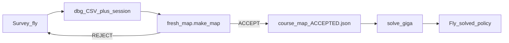

# PQ procedure: map -> solve -> race

Spec: `20260818_PQ_Technical_Spec_0001.pdf` (VADR-TS-004 / 00.01).

- **15 min/day** on the real track.
- **2 laps** = complete run. Incomplete ranked by gates passed.
- Track **60x21 m**, gates 1.5 m inner opening, includes a **double gate**.
- PQ course != VQ2. VQ2 tapes are archive only.

Steady is a **mapper**, not the race solution. Race = trusted map + solve.

## Day 1 - before ANY mapping or racing (FAQ-driven, 2026-08-28)

Hard dependencies that are easy to forget until you're standing there:

Measurements in priority order (fills `config/archer_block2.toml`, whose
numbers are ALL estimates until then):

1. **All-up weight + hover throttle.** Two minutes with a scale and one
   hover. Pins `mass_kg`, `hover_pwm`, and the thrust curve's anchor point.
2. **Roll/pitch step response, SHORT BURSTS.** The cage is 5 x 5 m: a
   full step at race accel covers ~2.5 m in under a second, so steps are
   <=0.5 s with immediate recovery - the slew peak happens in the first
   ~0.2 s, so short bursts still capture it. Angular accel + settling ->
   the **attitude-slew limit (`a_lat_rate_max`)** and inertia.
   This is THE binding constraint on the heavy 8" build (8x4.1 = 0.51
   pitch ratio, efficiency prop; TWR est. 3-4.5:1 - tilt is cheap,
   rotation is slow). The planner has this ceiling wired in; it's waiting
   for the real number.
3. **Betaflight CLI `diff all`.** Rates, PIDs, filters, angle limit /
   ACRO, all at once. **Save the stock diff BEFORE any retune, to TWO
   places, one of them off the Jetson** (laptop + the Jetson) - 8"
   builds ship with heavy filtering and soft PIDs tuned for stability
   under payload, not racing; retuning for aggressive tracking is allowed
   (config yes, reflash no) and probably worth real time - cage only,
   with the stock diff as the way back.
4. **Throttle sweep** (hover, then steps; integrate accel) ->
   `curve_pwm`/`curve_acc`. Thrust ~ RPM^2, expect convex.
5. **Camera intrinsic calibration** - intrinsics NOT provided.
   Checkerboard (WE bring it - kit list), full grid sweep at race
   exposure/gain. No PnP/gate ranging is trustworthy before this.
   Extrinsic: our cal + the PROVIDED IMU pose in the airframe.
6. Confirm camera mode 1 (1920x1080@60), timestamps sane vs IMU stream.

Items 1-4 need no course -> training cage (manual piloting allowed - a
human can fly the excitation), never race-slot time.

**Rehearse EVERY measurement above in the sim first.** Not for the values
- those don't transfer - but to debug the procedure itself: how many step
amplitudes you need, whether the log capture drops data, how much settle
time each step really takes. There is exactly one day 1.
Slew measurement is already runnable: `RACE_SOLVER=solvers.sysid_slew`
(protocol + analyzer in `src/raceline/sysid_slew.py`).

## Daily clock (15 min)

| Min | Action |
|-----|--------|
| 0-6 | Survey fly (steady or equivalent visual) - collect dbg + session ticks |
| 6-10 | `make_map` -> accept/reject. **REJECT -> stop; do not race garbage** |
| 10-15 | One solved heat on ACCEPTED map only (giga/ace/CL - not untrusted open-loop) |

One question per heat. No per-gate open-loop tuning.

## Pipeline



### Survey -> map

```bash
cd src
# CONTROL_MODE = steady  (survey)
python main.py

python -m analysis.fresh_map.make_map <dbg.csv> <session>
# ACCEPT writes pilots/*/course_map_ACCEPTED.json (map_resolve priority 1)
# REJECT exits 1 - do not solve/race
```

### Solve -> heat

```bash
cd src
python -m analysis.solve_giga
# CONTROL_MODE = giga   # or ace once map is ACCEPTED
python main.py
```

## On-site rules

- First heat of a new course = **survey**, not a VQ2 tape.
- Double gate: confirm extract gets two gate IDs / correct association before ACCEPT.
- Map legs that cannot fit in 60x21 -> REJECT / re-survey.
- Never Frankenstein surveys across a topology fork.
- Incomplete run still scores by gates - prefer finishing early gates cleanly over a wild full-lap attempt on a bad map.

## Modes

| Mode | Role |
|------|------|
| `steady` | Survey / map source only |
| `giga` / `ace` | Race after ACCEPTED map + solve |
| `fair` | Observe-only shell until it beats survey without fighting vision |
| VQ2 sacred tapes | Archive - never PQ smoke |

## Abort

- Lost gate / wrong opening on survey: abort, restart survey.
- ACCEPT fail: do not solve; re-fly survey.
- Detector dead: fix vision before trusting extract.
